# Flourish Travel — Sơ đồ luồng nghiệp vụ

> Tài liệu trực quan suy ra từ code FE + BE.  
> File nguồn Mermaid: [`docs/business-flows/*.mmd`](./business-flows/)  
> Cập nhật: 2026-06-27

**Cách xem:** GitHub/GitLab render Mermaid trực tiếp. VS Code/Cursor: cài extension *Markdown Preview Mermaid Support* hoặc mở file `.mmd` trên [mermaid.live](https://mermaid.live).

---

## Mục lục

| # | Sơ đồ | File nguồn |
|---|--------|------------|
| 1 | [Kiến trúc tổng quan](#1-kiến-trúc-tổng-quan) | `01-overview.mmd` |
| 2 | [Auth & phân quyền](#2-auth--phân-quyền) | `02-auth-roles.mmd` |
| 3 | [User — Khám phá tour](#3-user--khám-phá-tour) | `03-user-browse-tour.mmd` |
| 4 | [User — Đặt tour & thanh toán](#4-user--đặt-tour--thanh-toán) | `04-user-booking-payment.mmd` |
| 5 | [User — Chuyến đi của tôi](#5-user--chuyến-đi-của-tôi) | `05-user-my-journey.mmd` |
| 6 | [User — Vé, điểm đến, CMS](#6-user--vé-điểm-đến-cms) | `06-user-catalog-destination.mmd` |
| 7 | [User — Tài khoản](#7-user--tài-khoản) | `07-user-account.mmd` |
| 8 | [Flora AI](#8-flora-ai) | `08-flora-ai.mmd` |
| 9 | [Admin — Vòng đời tour](#9-admin--vòng-đời-tour) | `09-admin-tour-lifecycle.mmd` |
| 10 | [Admin — Vận hành](#10-admin--vận-hành) | `10-admin-operations.mmd` |
| 11 | [Guide — Portal HDV](#11-guide--portal-hdv) | `11-guide-portal.mmd` |
| 12 | [Máy trạng thái](#12-máy-trạng-thái) | `12-state-machines.mmd` |
| 13 | [End-to-end](#13-end-to-end) | `13-end-to-end.mmd` |
| 14 | [Quan hệ entity](#14-quan-hệ-entity) | `14-entity-relations.mmd` |

---

## 1. Kiến trúc tổng quan

Ba portal FE kết nối REST API `/api`, xử lý bởi Spring Boot → PostgreSQL.

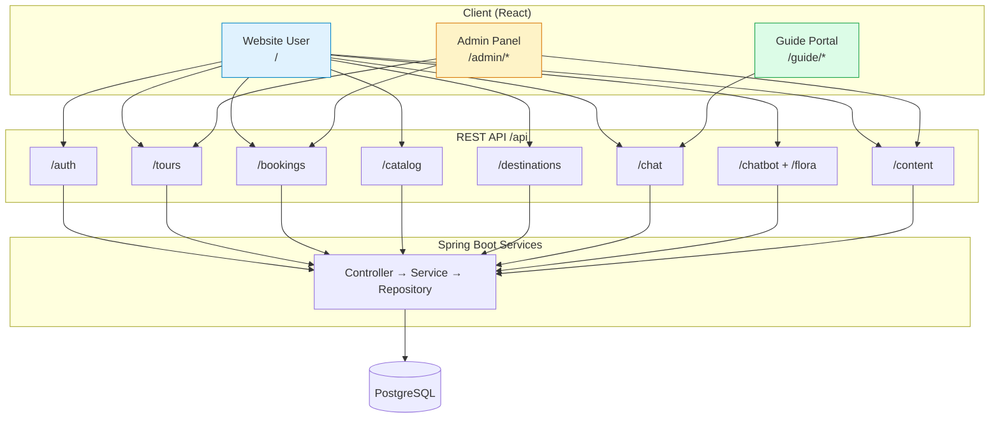

---

## 2. Auth & phân quyền

| Role BE | Role FE | Sau login |
|---------|---------|-----------|
| `ADMIN` | `admin` | `/admin` |
| `TOUR_GUIDE` | `guide` | `/guide/dashboard` |
| `TRAVELER` | `user` | `/` |

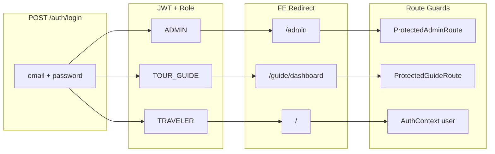

---

## 3. User — Khám phá tour

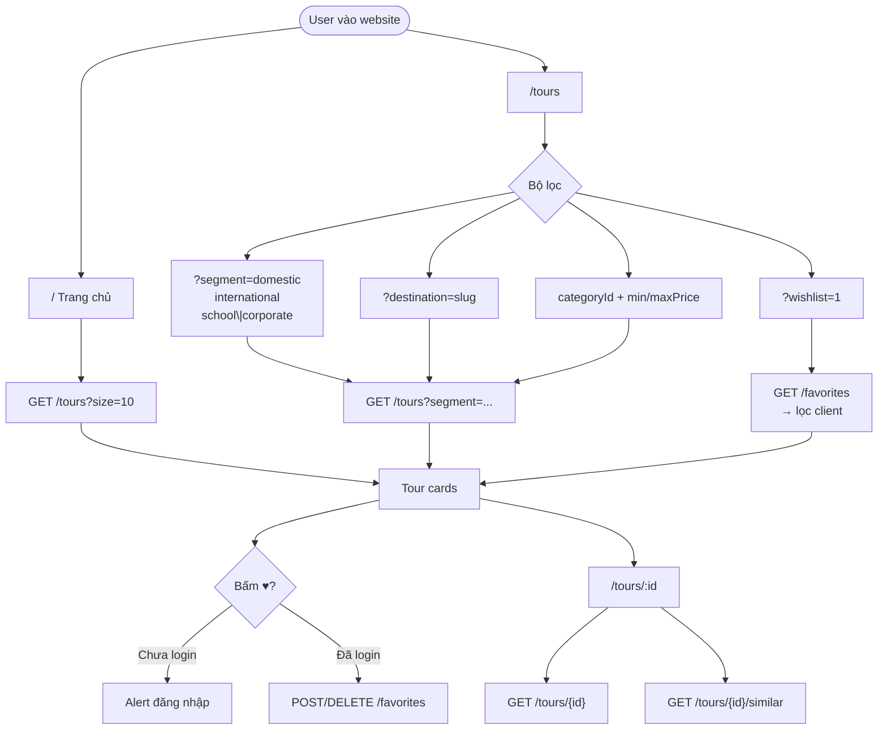

---

## 4. User — Đặt tour & thanh toán

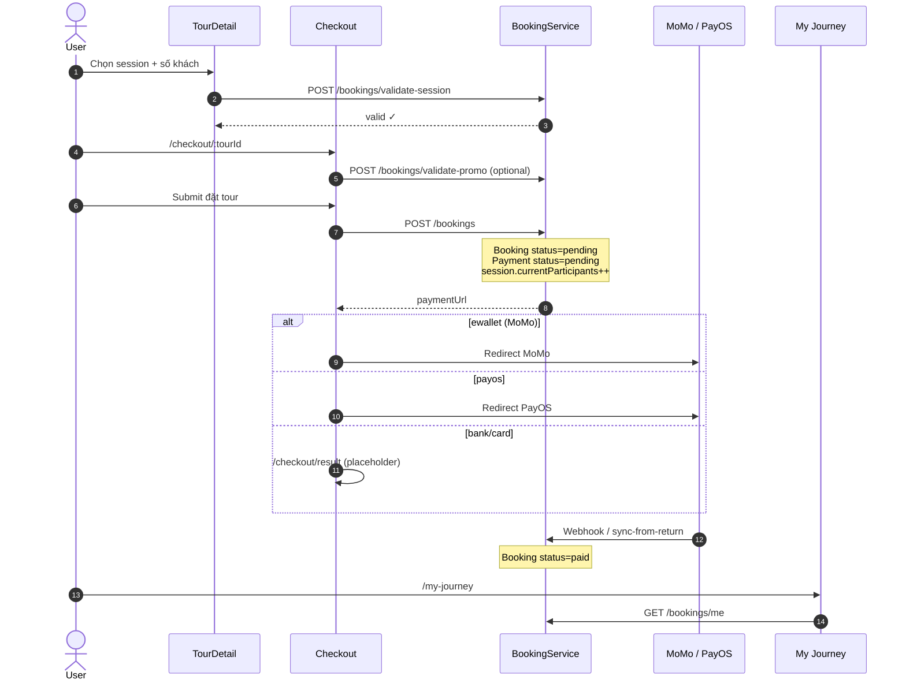

---

## 5. User — Chuyến đi của tôi

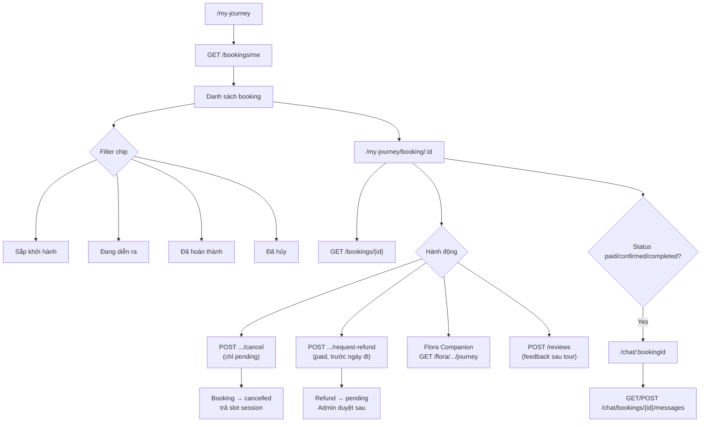

---

## 6. User — Vé, điểm đến, CMS

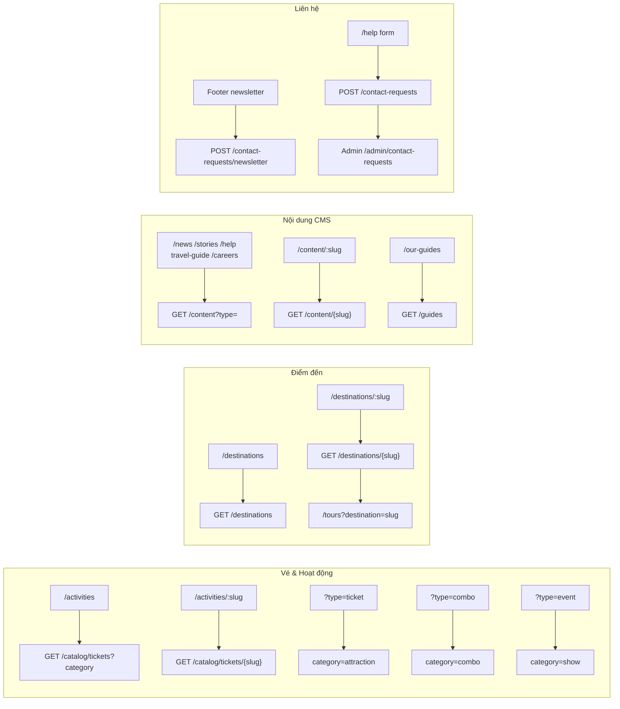

---

## 7. User — Tài khoản

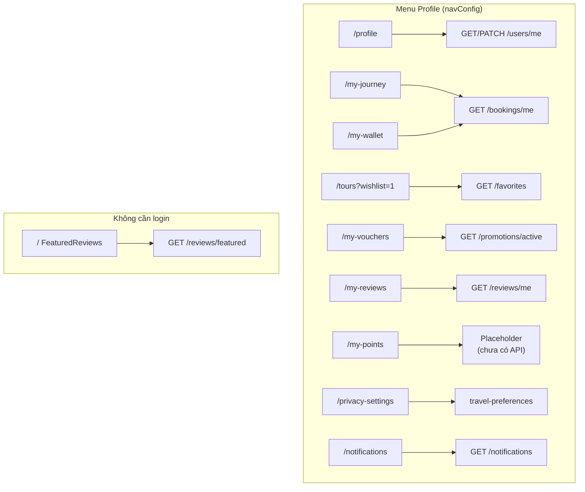

---

## 8. Flora AI

Hai kênh tách biệt: **FAB toàn site** (chatbot) và **Companion gắn booking**.

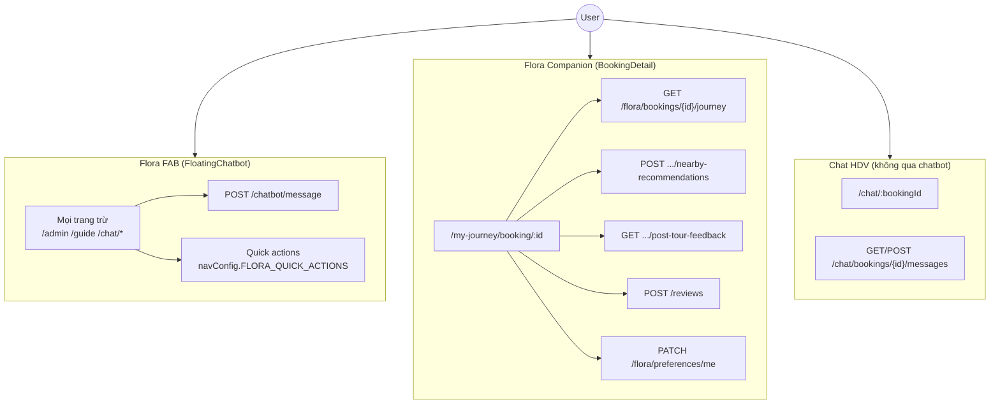

Chi tiết Flora MVP: [`docs/flora-ai/use-case-diagram.mmd`](../flora-ai/use-case-diagram.mmd)

---

## 9. Admin — Vòng đời tour

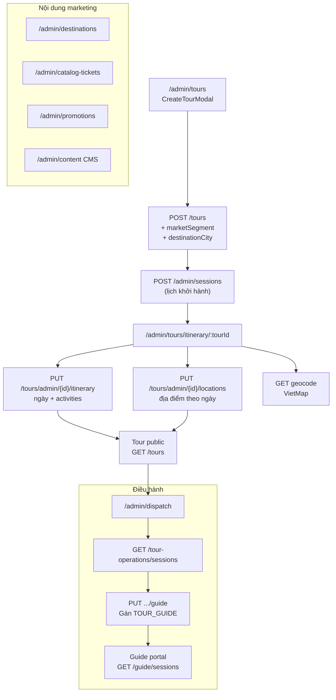

---

## 10. Admin — Vận hành

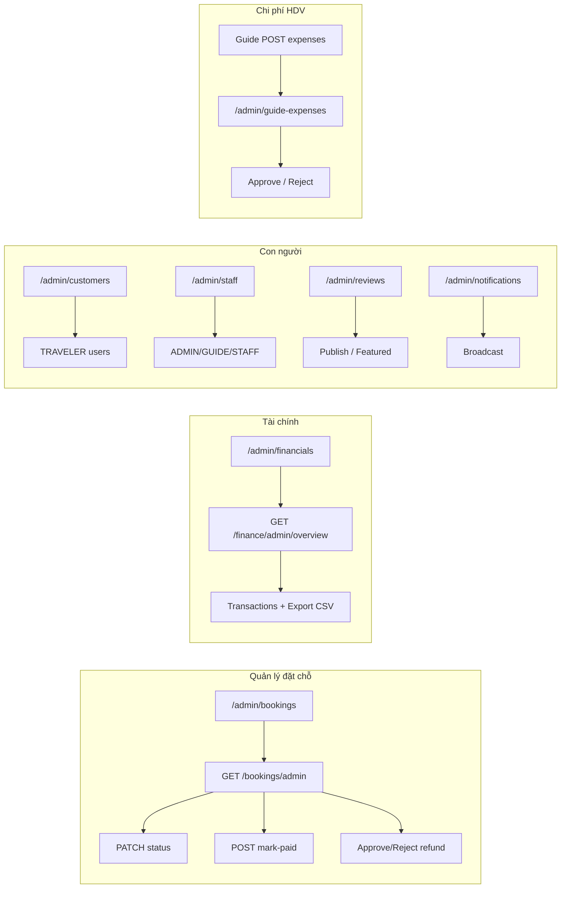

---

## 11. Guide — Portal HDV

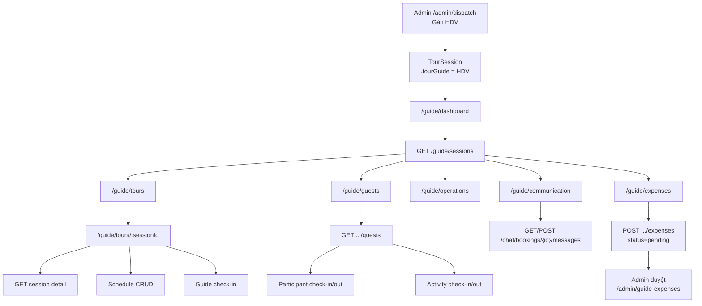

---

## 12. Máy trạng thái

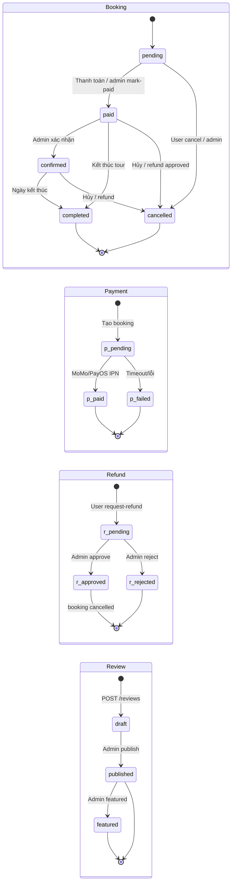

---

## 13. End-to-end

Luồng đầy đủ từ admin tạo tour đến user đánh giá sau chuyến.

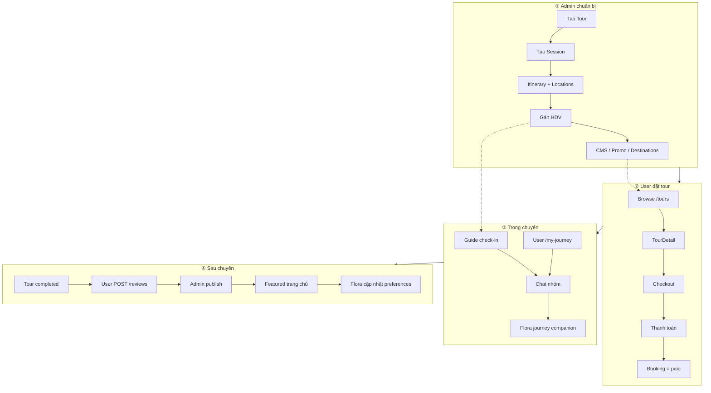

---

## 14. Quan hệ entity

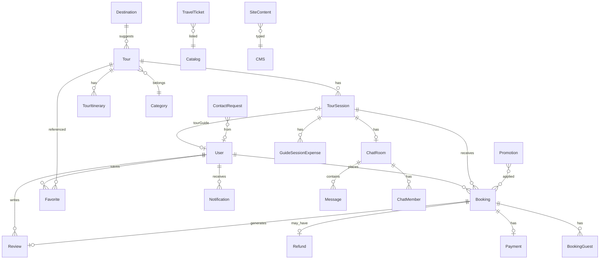

---

## Phụ lục — Route map

<details>
<summary>User routes (click mở)</summary>

```
/  /help  /login  /register  /profile  /privacy-settings
/my-journey  /my-journey/booking/:bookingId
/my-wallet  /my-vouchers  /my-reviews  /my-points
/destinations  /destinations/:slug  /travel-guide
/our-guides  /our-guides/:id  /notifications
/tours  /tours/:id  /activities  /activities/:slug
/checkout/:tourId  /checkout/result  /chat/:bookingId
/news  /stories  /content/:slug  /careers  /about  /policies...
```

</details>

<details>
<summary>Admin routes</summary>

```
/admin  /admin/tours  /admin/tours/itinerary/:tourId
/admin/categories  /admin/dispatch  /admin/bookings
/admin/customers  /admin/financials  /admin/promotions
/admin/catalog-tickets  /admin/destinations  /admin/content
/admin/reviews  /admin/notifications  /admin/contact-requests
/admin/guide-expenses  /admin/staff  /admin/settings
```

</details>

<details>
<summary>Guide routes</summary>

```
/guide/dashboard  /guide/tours  /guide/tours/:tourId
/guide/guests  /guide/communication  /guide/operations  /guide/expenses
```

</details>

---

*Tham chiếu: [`STRUCTURE.md`](../../STRUCTURE.md) · [`docs/flora-ai/overview.md`](../flora-ai/overview.md)*
